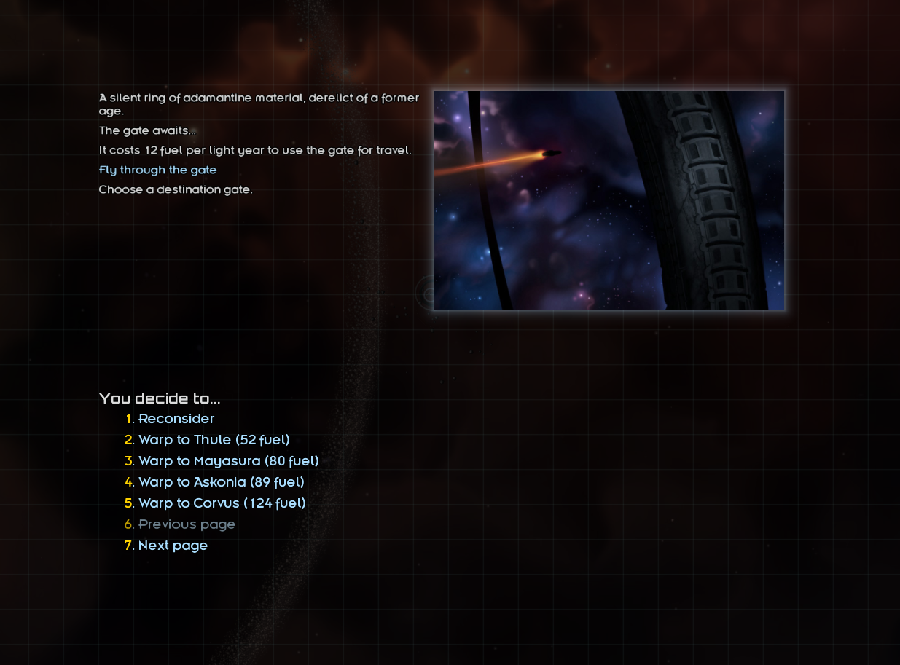

# Active Gates

Starsector mod that allows travel the player to activate gates, for a cost.

The player may use fuel to travel between any two active gates.

## Compiling this Mod

1. Check out the source.
2. Ensure you have java installed and accessible via system variable.
3. Open up `build.gradle.kts` in a text editor and change `starsectorCoreDirectory` to point to your `starsector-core` directory.
4. Open a terminal in the root directory of the mod and type
   1. Unix: `./gradlew build jar`
   2. Windows: `gradlew.bat build jar`
5. You should now (eventually) have a jar built at `jars/Active-Gates.jar`.

## Changelog

### 1.0 - 6 Jan, 2019 - by *Wispborne*

- Works with Starsector 0.9a (previous version did also).
- May now jump to any activated gate.
- Cost of activation changed to 500 metal, 250 heavy machinery, and 1 gamma core.
- Smoothed numerous rough edges, such as wording and navigation within the dialog.
- Now displays the fuel cost per jump.
- General code refactoring. Added IntelliJ project, converted to Kotlin.

### 0.2.0 - 29 July, 2017 - by *toast*

- Fuel cost now dependent on distance.
- Reduce fuel cost multiplier to 1.
- Can select from up to 5 of the closest systems with activated gates.

### 0.1.5 by *toast*

- General refactoring.
- Add gate activation cost and gate fuel usage cost.
- Costs can be changed by modifying data/config/settings.json.

### 0.1.0 by *toast*

- Initial drop.

## TODO

- Update gate description when approaching an active gate.
- See if it's possible to change the player's map to show "Gate (Active)" instead of "Gate (Inactive)"
