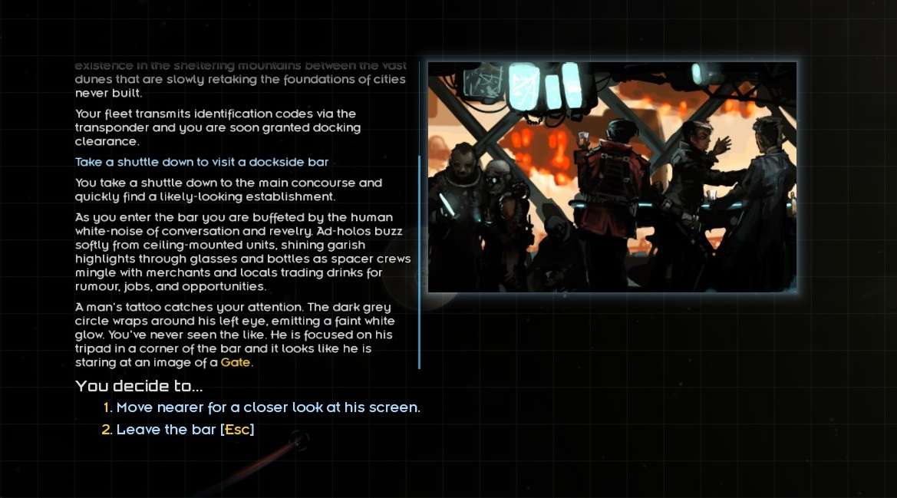

# Gates Awakened

Gates Awakened is a mod for the excellent game [Starsector](https://fractalsoftworks.com/).

It adds a short series of missions that open up instantaneous travel between Gates from the ancient Domain of Man - but you are limited to only a small number of Gates, so adjust accordingly.

Gates Awakened tries to encourage early exploration and ease later-game traveling, without feeling like a cheat. While it is, of course, not canon, it fits smoothly into lore of the game.

Once a Gate is activated, the player may use fuel, based on distance, to travel to any other active Gate.

Massive thanks to _toast_ for his inspirational mod, [Active Gates](https://fractalsoftworks.com/forum/index.php?topic=12791.0), without which this mod would not exist.

## Compiling this Mod

1. Clone this source code.
2. Ensure you have java installed and accessible via system variable.
3. Open up `build.gradle.kts` in a text editor and change `starsectorCoreDirectory` to point to your `starsector-core` directory.
4. Open a terminal to the root directory of the mod and type
   1. Unix: `./gradlew build jar`
   2. Windows: `gradlew.bat build jar`
5. You should now (eventually) have a jar built at `jars/Active-Gates.jar`.

## Changelog

### 1.0

- Initial release
